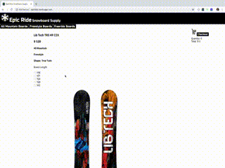

# Epic Ride Snowboard Supply

This was my first React / Redux project and is strictly a single page app. It is a snowboard shopping cart app that connects to the Stripe API for credit card processing.

### Live Url ###

https://epicride.herokuapp.com/   (May take some time to load due to Heroku's sleep mode on free accounts)

### Front End ###

The front end of this project was built with React, Redux, Bootstrap, JSX and CSS.

### Back End ###

The back end of this project was built with Node.js , Express.js and MongoDB. 

### Demo ###

  

